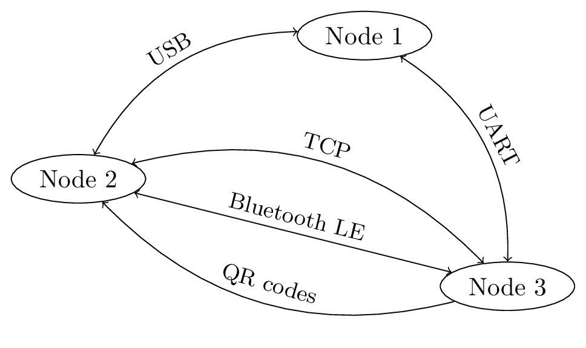
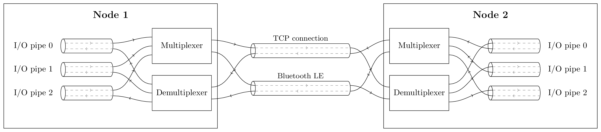

## Overview ##

The goal of Fibre is to provide a framework to make suckless distributed applications easier to program.

In particular:

 - Nobody likes boiler plate code. Using a remote object should feel almost
   exactly as if it was local. No matter if it's in a different process, on
   a USB device, connected via Bluetooth, over the Internet or all at the
   same time.
   All complexity arising from the system being distributed should be taken
   care of by Fibre while still allowing the application developer to easily
   fine-tune things.

 - Fibre has the ambition to run on most major platforms and provide bindings
   for the most popular languages. Even bare metal embedded systems with very
   limited resources. See the Compatibility section for the current status.

 - Once you deployed your application and want to change the interface, don't
   worry about breaking other applications. With Fibre's object model, the
   most common updates like adding methods, properties or arguments won't
   break anything. Sometimes you can get away with removing methods if they
   weren't used by other programs. **This is not implemented yet.**

## Current Status ##

Most aspects of Fibre are being reworked for v0.2.0.
[Technical Specification](#technical-specification) depicts an accurate outline of the rework.

Currently you can publish a function in C++ like this:

```cpp
void my_function(uint32_t input1, uint32_t& output1) {
    [...]
}

FIBRE_EXPORT_FUNCTION(my_function, INPUTS("input1"), OUTPUTS("output1"));

void main() {
    fibre::init()
}
```

Any number of input and output values are supported. Only a few types are supported though.

See `test/test_server.cpp` for details.

`tools/fibre-shell` will connect to the test_server, instantiate a `RemoteNode` and invoke `_interrogate` on that instance. For testing purposes you can put code there to invoke remote functions.

### Changes from v0.1.0 to v0.2.0 ###

 * Support for multiple channels per remote node
 * Functions can have multiple input/output arguments and theoretically unlimited input/output data size
 * One function call corresponds to one endpoint operation and can be sent in a single message.
 * Each function has an independent JSON snippet, allowing for adding functions dynamically at runtime
 * Same for types (not implemented yet)

### TODO for v0.2.0: ###

 - [ ] [general] Return ACKs/NACKs to make functions without return values work.
 - [ ] [C++] add resend timer like in python (see `remote_node.py` vs `remote_node.cpp`)
 - [ ] [C++] Return the proper JSON snippet for each function signature (currently a "demo"-string is built). See `FunctionJSONAssembler`.
 - [ ] [C++] Publish object reference types similar to how functions are published and build a constexpr JSON string that describes each type.
 - [ ] [C++] Garbage collect RemoteNodes that are no longer in active contact (how?)
 - [ ] [C++] Replace all std::vector and std::unordered_map by statically sized alternatives (with a config option).
 - [ ] [Python] Dynamically build objects from JSON
 - [ ] [C++/Python] make USB, UDP and UART work again


## Show me some code

**This section is not up-to-date**

**TODO: move this to the respective language repos**

Consider this program:

```
class TestClass {
public:
    float property1;
    float property2;

    float set_both(float arg1, float arg2) {
        property1 = arg1;
        property2 = arg2;
        return property1 + property2;
    }
};


int main() {
    TestClass test_object = TestClass();

    while (1) {
        printf("test_object.property1: %f\n", test_object.property1);
        usleep(1000000 / 5); // 5 Hz
    }
}
```

Say you want to publish `test_object` so that a remote Fibre node can use it.

1. Add includes
      ```C++
      #include <fibre/protocol.hpp>
      #include <fibre/posix_tcp.hpp>
      ```
2. Add Fibre export definitions to the exported class
      ```C++
      class TestClass {
            [...]
            FIBRE_EXPORTS(TestClass,
                  make_fibre_property("property1", &property1),
                  make_fibre_property("property2", &property2),
                  make_fibre_function("set_both", *obj, &TestClass::set_both, "arg1", "arg2")
            );
      };
      ```
   Note: in the future this will be generated from a YAML file using automatic code generation.

3. Publish the object on Fibre
      ```C++
      auto definitions = test_object.fibre_definitions;
      fibre_publish(definitions);
      ```
   Note: currently you must publish all objects at once. This will be fixed in the future.

4. Start the TCP server
      ```C++
      std::thread server_thread_tcp(serve_on_tcp, 9910);
      ```
      Note: this step will be replaced by a simple `fibre_start()` call in the future. All builtin transport layers then will be started automatically.

## Adding Fibre to your project ##

We recommend Git subtrees if you want to include the Fibre source code in another project.
Other contributors don't need to know anything about subtrees, to them the Fibre repo will be like any other normal directory.

#### Adding the repo
```
git remote add fibre-origin git@github.com:samuelsadok/fibre.git
git fetch fibre-origin
git subtree add --prefix=fibre --squash fibre-origin master
```
Instead of using the upstream remote, you might want to use your own fork for greater flexibility.

#### Pulling updates from upstream
```
git subtree pull --prefix=fibre --squash fibre-origin master
```

#### Contributing changes back to upstream
This requires push access to `fibre-origin`.
```
git subtree push --prefix=fibre fibre-origin master
```

## Technical Specification ##

### Low Level ###

Fibre Nodes are interconnected through any number and any type of unidirectional or bidirectional channels:



_(Currently Fibre nodes can only communicate when there is a direct channel between them. Support for thin and thick relays will be added later, see future concepts)_

Between any two actively interacting nodes, one or more bidirectional pipes are establised:



Pipes guarantee that the data inserted on one side arrives reliably on the other side, unless the pipe breaks, in which case the sender will know about it _(we may add support for less reliable pipes later)_. Furthermore pipes support packet breaks that can be used by the sender to signal the end of a packet.

Since a node needs to allocate local resources (e.g. pipe buffers) for every remote node that it wants to talk to, the number of concurrent communication parners of a certain node may be limited and may be as low as one. Likewise, the number of concurrent pipes per remote node may be limited to one.

The multiplexer is responsible of checking the output pipes for pending data and choose wisely on which output channel to emit which chunks of data. This scheduling algoritm may depend on several factors, for instance pipe priorities, channel bandwidth and channel latency. If lossy channels are used the scheduler may further have to resend unacknowledged chunks after some time.

The exact data format may vary depending on the channel type but currently for TCP it looks like this:

```
+----------+-------+-------+-------+-----
| own UUID | chunk | chunk | chunk | ...
+----------+-------+-------+-------+-----
```

where each chunk looks like this:
```
+---------+--------------+--------------+---------+
| pipe ID | chunk offset | chunk length | payload |
+---------+--------------+--------------+---------+
```

Each field is a 16 bit little endian unsigned integer. Chunk offset describes where in the pipe's stream this chunk belongs. The chunk length is the number of bytes in the payload, left-shifted by one. The LSB is the "packet break" bit, 1 indicating that a packet break should be inserted at the end of this chunk.

_(currently there is an additional CRC field in the chunk header. It's 0x1337 at offset 0 and from there tracks the CRC of the pipe stream. Not sure if we should keep that)_

### High Level ###

A Fibre node can implement one or two of the following roles:

* **Server:** exposes local functions and publishes local objects.
* **Client:** invokes remote functions and makes use of remote objects.

To call a function on a given remote node, the server does the following:
1. Select an inactive pipe.
2. Send the desired function's ID and hash value on the pipe.
3. Serialize the function arguments onto the pipe, one by one.
4. Send a packet break on the pipe.
5. On the corresponding input pipe, deserialize the function's results. The client should also terminate the result with a packet break.

This requires prior mutual agreement on several things, e.g. function ID, function inputs/outputs and their raw data formats. Therefore Fibre defines several canonical functions that can be used by the server to interrogate the client about other exposed functions.

**to be continued ...**

### Future Concept: Relays ###

**Thin Relays** expose their own channels as endpoints and thereby allow other clients to use their channels to communicate with a more distant node. This allows multi-hop networking across nodes with very limited resources.

**Thick Relays** transparently collapse the complete network layout into one flat node. All functions and objects of remote nodes are advertised to adjacent nodes as if they were local to the the relay. This allows nodes with limited resources to communicate with a larger part of the network.
On a desktop PC, it also allows to concentrate all resources of Fibre in a single hub service, such that multiple user programs can plug in easily with minimal additional resources.


## Comparison

There are many existing communication frameworks, so why build yet another one? The answer is that none of these frameworks seem to fully align with the following three aspects:

 * From a user experience standpoint, it's important that a communication framework can cope with a complex, heterogeneous and dynamic network topology and supports zero-config operation.
 * From a developer standpoint, it's important that a framework is intuitive to use, feels native to any language and runs on any platform. In the age of robotics and IoT, this includes embedded systems.
 * From an operations perspective it's important that a single file can be used as a root interface definition, that this interface doesn't  unnecessarily dictate implementation details and that updates to this definition don't break deployed applications too easily.

Below is a table to compare details of a couple of popular framworks and Fibre. Scroll down for further explanation of some of the points.

|   | Fibre | gRPC | Apache Thrift | Apache Avro RPC | ROS | D-Bus | Wayland | PJON |
|---|---|---|---|---|---|---|---|---|
| **General** |
| Domain | general purpose | cloud backend & frontend | cloud backend | cloud backend | robotics | local IPC | graphics | embedded systems
| Programming model | function calls and properties (static or on objects) | function calls on services | function calls on objects | | messages on topics | function calls on objects | function calls on objects | raw data bus
| Language-agnostic IDL | planned for v0.3.0 | yes (protobuf IDL) | [yes (custom)](http://thrift-tutorial.readthedocs.io/en/latest/thrift-file.html) | | [yes (custom)](http://wiki.ros.org/msg) | [yes (XML)](https://dbus.freedesktop.org/doc/dbus-specification.html#introspection-format) | [yes (XML)](https://github.com/wayland-project/wayland/blob/master/protocol/wayland.xml) | no |
| Platform support <sup>[1](#footnote-platform)</sub> | any | any | any | | Linux | Linux | Linux | any
| Language support | C++, Python | most | most | | most | [most](#https://www.freedesktop.org/wiki/Software/DBusBindings/) | | C++, Python
| Transport support <sup>[2](#footnote-transport)</sub> | TCP, UDP, USB, UART | TCP | TCP, Unix domain sockets, shared memory | | [TCP, UDP](#http://wiki.ros.org/ROS/Technical%20Overview#Node) | [Unix domain sockets, TCP](https://www.freedesktop.org/wiki/IntroductionToDBus/) | [Unix domain sockets](https://wayland.freedesktop.org/docs/html/ch04.html), [shared memory](https://wayland.freedesktop.org/docs/html/apa.html#protocol-spec-wl_shm) | TCP, UDP, UART
| **Network Architecture** |
| Service/object discovery <sup>[3](#footnote-discovery)</sub> | USB, UART: yes; TCP, UDP: planned for v0.4.0 | no | [no](https://stackoverflow.com/questions/13530391/apache-thrift-service-auto-discovery) | | no | yes | yes | [by device ID](https://github.com/gioblu/PJON/blob/master/examples/LINUX/Local/EthernetTCP/PingPong/Transmitter/Transmitter.cpp)
| Channel multiplexing <sup>[4](#footnote-multichannel)</sub> | yes (v0.2.0) | no | no | | no | | no | no
| Multihop networking <sup>[5](#footnote-multihop)</sub> | planned for v0.4.0 | no | no | | no | | no | [yes](https://github.com/gioblu/PJON/blob/master/specification/PJON-protocol-specification-v3.0.md#router)
| Support for lossy channels | yes | no | no | | yes (UDP) | | | yes
| Transport Encryption | planned for v1.0 | [yes](https://bbengfort.github.io/programmer/2017/03/03/secure-grpc.html) | [yes](https://chamibuddhika.wordpress.com/2011/10/03/securing-a-thrift-service/) | | experimental | no | no | not yet
| Access control <sup>[6](#footnote-access-control)</sub> | planned for v1.0 | [yes](https://grpc.io/docs/guides/auth.html#authentication-api) | [no](http://www.doublecloud.org/2014/01/user-authentication-with-thrift-service-comparing-different-approaches/) | | experimental | yes | | not yet
| **Design Details** |
| Documentation embedded in IDL <sup>[7](#footnote-idl-doc)</sup> | planned for v0.3.0 | [no](https://developers.google.com/protocol-buffers/docs/proto) | [no](https://thrift.apache.org/docs/idl) | | [no](http://wiki.ros.org/msg) | [no](https://dbus.freedesktop.org/doc/dbus-specification.html#introspection-format) | [yes](https://github.com/wayland-project/wayland/blob/master/protocol/wayland.xml) | N/A
| Flexible type matching <sup>[8](#footnote-type-matching)</sub> | planned for v1.0 | no | no | | no | | | N/A
| Streaming mode <sup>[9](#footnote-streaming)</sub> | yes (v0.2.0) | [yes](https://grpc.io/docs/guides/concepts.html#service-definition) | [yes](https://github.com/erikvanoosten/thrift-stream) | | yes | | | yes
| Threadless mode <sup>[10](#footnote-threads)</sub> | yes | | | | | | | yes
| Static memory mode <sup>[11](#footnote-memory)</sub> | yes | | | | | | | probably
| Runtime interface introspection <sup>[12](#footnote-introspection)</sub> | yes | no | no | | [no](http://wiki.ros.org/Messages) | [yes](https://dbus.freedesktop.org/doc/dbus-specification.html#introspection-format) | | N/A


<a name="footnote-platform">1</a>: "any" means at least Linux, Windows and macOS. Given that these three are supported, it is likely that support can easily be added for other desktop systems. For embedded systems there are usually more strict requirements which are addressed separately.

<a name="footnote-transport">2</a>: Most of the listed framworks are extensible with custom transport layers. However if a framework only officially supports TCP, it is unlikely that adding support for unreliable channels like UART will be trivial. Furthermore such extensions may need to be implemented separately for each language and platform that is used.

<a name="footnote-discovery">3</a>: A client can discover compatible devices/applications in its vicinity with zero or near-zero user input using techniques like Bonjour/Avahi or USB device enumeration.

<a name="footnote-multichannel">4</a>: Two peers can use multiple transport channels at the same time and switch between channels without breaking the connection. This is essential for mobile applications where IP addresses change spontaneously. It is also useful to fully exploit each channel's advantages (i.e. latency vs bandwidth vs dependability).

<a name="footnote-multichannel">5</a>: Peers can communicate even if there is only an indirect connection. This is useful for IoT meshes and complex robot architectures, where some microcontrollers are not directly connected to the command issuing client.

<a name="footnote-access">6</a>: The framework allows to grant different users access to different feature sets of a service. This is useful for smart home devices or any application that has multiple users.

<a name="footnote-idl-doc">7</a>: The interface description language allows for embedding plain-text documentation for functions and arguments, so that the interface definition file is the only true source of the interface specification. This is important so that the same file can be used to autogenerate documentation in HTML or other formats, and to automatically add the same documentation to function stubs.

<a name="footnote-type-matching">8</a>: The interface definition does not dictate the actual data types that implementations should use. One device may use uint16_t to represent an index, while another device may use uint32_t to represent the same value. This is makes interface definitions more future-proof and not favor devices with either small or large memory.

<a name="footnote-streaming">9</a>: The framework allows function implementers to receive/return theoretically infinite sized values in a stream-oriented way. This is important for memory constrained devices.

<a name="footnote-threads">10</a>: The framework can be used in a purely single-threaded environment, e.g. an embedded system without multithreading support.

<a name="footnote-memory">11</a>: The framework can be configured to use only static memory. Certain runtime parameters may be limited in this mode (e.g. the number of concurrent connections).

<a name="footnote-introspection">12</a>: A server is able to send its own interface description to clients at runtime so that clients can interact with objects without prior knowledge of the interface. This is useful for rapid prototyping (e.g. Python), interactive shells and automatic interfacing with other protocols.

Other stuff:

 * ZeroCM
 * Matrix


## Projects using Fibre ##

 - [ODrive](https://github.com/madcowswe/ODrive): High performance motor control
 - [lightd](https://github.com/samuelsadok/lightd): Service that can be run on a Raspberry Pi (or similar) to control RGB LED strips

## Contribute ##

This project losely adheres to the [Google C++ Style Guide](https://google.github.io/styleguide/cppguide.html).


## Stream multiplexer vs object multiplexer

**Stream oriented endpoints**
An endpoint has an input and output stream. A stream has metadata such as available/active codecs.

Con: Once the data is encoded for a particular stream, it cannot be transcoded by the framework because it has no knowledge about the data format.

**Function oriented endpoints**
An endpoint is a function taking and returning arguments in decoded form.
The data received/transmitted is finite.

Pro: Encoding can be deferred until the underlying transport stream is ready.
Con: Functions can only start operating once all data is received For realtime streams such as audio streams this is unsuitable because it requires the fragmentation of what would be a stream into frames. It is not clear what frame size to choose.

**Object streams**
The framework has knowledge of the underlying value type and decodes it before passing to the endpoint. Arguments can be infinite.

Pro: Encoding/Decoding can be handled by the framework with knowledge about input/output streams.
Allows for "delta" transmission, such as wavelet-transformed images.

## Lifecycle of an object stream based endpoint

By default the objects coming in are not exclusive (multiple access) and unordered
Con: An output is no longer associated with an input. Cannot return results on same channel

 * Objects coming from the same origin should keep their relative order
 * Objects coming from different origins may arrive interleaved, but a single slice will always be from a single source


oooooo---->oooo [decoder] => object1, object2
       \--->oo|aa [decoder] => object1, object2
aa-----/


Normal transmission:

bytes 0 - 55        response: 0 bytes
break               break
bytes 36 - 39       response: 4 bytes
bytes 40 - 43       
break               break
bytes 44 - 50       response: 4 bytes
break               break
break           

interleaved with:
 1. client: drop bytes 36 - 39
 2. server: ack input pipe 4, bytes 12 - 30
 3. server: consider 4 bytes from input pipe omitted
 4. server/client: switch to pipe 3, offset 12

length + flags

flags:
    0: packet break after chunk
   01: pipe break after chunk
  011: packet break and pipe break after chunk

0x01 0x03 0x0C

How to cancel an RPC:
 1. send "drop bytes 36 - 43"
 2. 

